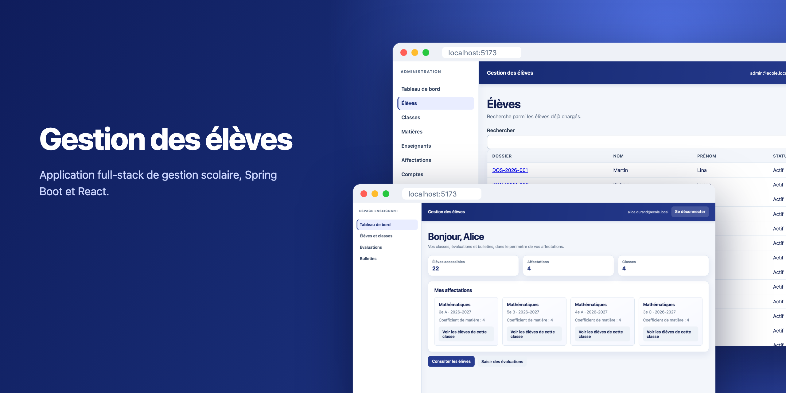
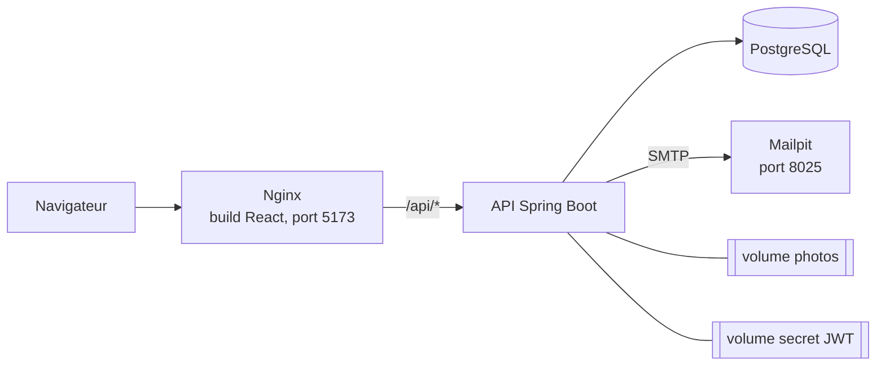

# Gestion des élèves

[English](README.md) | **Français**



Application de gestion scolaire composée d’une API Spring Boot et d’un frontend React.
L’administration gère les élèves, les classes, les enseignants et les matières. Les enseignants
saisissent les notes des classes qui leur sont affectées. L’application calcule les moyennes
pondérées et produit les bulletins trimestriels en PDF.

Projet réalisé pendant la formation CDA (Concepteur Développeur d’Applications) à l’AFPA, en 2026.


## Captures d’écran

Captures réalisées avec Docker Compose et un jeu de données de démonstration : 4 classes,
22 élèves, 8 enseignants et les notes du premier trimestre.

| | |
|---|---|
|  |  |
| Liste des élèves avec recherche | Fiche élève : photo, inscriptions, responsables légaux |
|  |  |
| Affectations (enseignant, matière, classe, coefficient) | Comptes utilisateurs et invitations |
|  |  |
| Brouillons, publication et historique des bulletins | Bulletin généré en PDF |
|  |  |
| Tableau de bord enseignant, limité à ses affectations | Saisie des notes d’un élève |
|  |  |
| Connexion | E-mail d’activation, reçu dans Mailpit en développement |

## Fonctionnalités

### Portail administrateur

- Gestion des élèves, classes, matières et enseignants.
- Photo d’élève (JPEG, PNG ou WebP, 5 Mo au maximum).
- Inscription d’un élève dans une classe, transfert vers une autre classe, fin ou annulation.
  Les anciennes inscriptions restent dans l’historique.
- Association de responsables légaux, avec lien de parenté, responsable principal, autorité
  parentale et contact d’urgence.
- Affectation d’un enseignant à une matière dans une classe pour une année, avec coefficient.
- Invitation des comptes enseignant et responsable par e-mail, renvoi d’invitation, désactivation.
- Génération d’un brouillon de bulletin, publication, puis correction sous forme de nouvelle version.

### Portail enseignant

- Accès limité aux classes, élèves et matières de ses affectations.
- Saisie et modification des notes (sur 20, avec coefficient, date, libellé et commentaire).
- Consultation des bulletins publiés et téléchargement en PDF.

### Règles métier

- Un élève a au plus une inscription active par année scolaire.
- Une note doit viser un enseignement de la même classe et de la même année que l’inscription.
- La moyenne d’une matière est pondérée par le coefficient des notes, la moyenne générale par le
  coefficient des matières. Arrondi au demi supérieur, à deux décimales.
- Un bulletin enregistre un instantané des moyennes. Modifier une note ensuite ne change pas un
  bulletin publié ; l’administrateur publie une correction, qui devient une nouvelle version.
- Les notes et les bulletins utilisent le verrouillage optimiste : deux modifications simultanées
  ne peuvent pas s’écraser sans erreur.

L’API gère déjà le rôle `RESPONSABLE`, avec un accès limité à ses propres enfants. Les écrans
correspondants ne sont pas encore développés dans le frontend.

## Stack technique

| Domaine | Outils |
|---|---|
| Backend | Java 21, Spring Boot 3.5, Spring Web, Spring Data JPA, Bean Validation |
| Sécurité | Spring Security, OAuth2 Resource Server (JWT HS256), BCrypt |
| Base de données | PostgreSQL 15, Flyway (6 migrations, Hibernate en mode `validate`) |
| PDF et e-mails | OpenPDF, Spring Mail, Mailpit comme SMTP local |
| Frontend | React 19, TypeScript, Vite, React Router, Axios |
| Tests | JUnit 5, Mockito, AssertJ, MockMvc, Testcontainers, Vitest, Testing Library |
| Infrastructure | Dockerfiles multi-stage, Docker Compose, Nginx |
| Conception | Merise (MCD, MLD, MPD), UML avec PlantUML |

## Architecture



Seuls Nginx et Mailpit publient un port. L’API et la base de données ne sont joignables que sur le
réseau Docker interne.

Le backend est organisé en couches : les contrôleurs REST reçoivent et renvoient des DTO (records
Java), les services transactionnels portent les règles métier et les repositories Spring Data
accèdent à PostgreSQL. Les entités JPA ne sont jamais sérialisées directement. Un gestionnaire
d’exceptions unique renvoie les erreurs au format `ProblemDetail`. Les contrôles d’accès sont
regroupés dans `AccessPolicyService`, appelé par chaque contrôleur. Flyway fait autorité sur le
schéma ; Hibernate se contente de le valider au démarrage.

## Sécurité

- Les jetons d’accès sont des JWT de 15 minutes, gardés en mémoire côté client et jamais dans le
  `localStorage`.
- Le refresh token est stocké dans un cookie `HttpOnly`, `Secure`, `SameSite=Strict`, limité à
  `/api/auth`, valable 7 jours. Chaque rafraîchissement émet un nouveau jeton. Si un ancien jeton
  est présenté de nouveau, toute la famille de sessions est révoquée.
- Les routes d’authentification par cookie sont protégées contre le CSRF par double-submit.
- Pas d’inscription publique. L’administrateur crée le compte, l’utilisateur reçoit un lien
  d’activation à usage unique et choisit son mot de passe (12 à 64 caractères, haché avec BCrypt,
  coût 12).
- Les jetons d’activation et de réinitialisation sont des valeurs aléatoires de 256 bits. Seule
  leur empreinte SHA-256 est enregistrée.
- Chaque requête est vérifiée selon le rôle et l’appartenance de la ressource. Un enseignant qui
  demande un élève hors de ses classes reçoit `404` : l’API ne révèle pas que la fiche existe.
- Les événements de sécurité (invitations, activations, réinitialisations, réutilisation de jeton,
  désactivations) sont enregistrés dans une table d’audit.
- Le type réel des photos est vérifié par leur signature binaire, et elles sont stockées sous un
  nom UUID généré.
- Avec Docker, la clé de signature JWT est générée dans un volume au premier démarrage. Elle ne se
  trouve ni dans le dépôt ni dans une image.

## Lancer le projet

Il faut Docker avec Compose, et les ports 5173 et 8025 libres.

```bash
git clone https://github.com/x451F/gestion-eleves-spring-react.git
cd gestion-eleves-spring-react
docker compose up --build -d
```

L’application est sur http://localhost:5173 et Mailpit sur http://localhost:8025.

La base démarre vide. Le premier administrateur se crée avec le service ponctuel de bootstrap. Il
crée le compte en attente d’activation et envoie l’e-mail ; il ne définit jamais de mot de passe.

```bash
BOOTSTRAP_ADMIN_EMAIL=admin@ecole.local \
docker compose --profile bootstrap up bootstrap-admin
```

Ouvrez l’e-mail dans Mailpit, suivez le lien, choisissez un mot de passe et connectez-vous. Les
comptes enseignants s’invitent de la même façon depuis la page Comptes.

`docker compose down` arrête tout en conservant les données. Ajoutez `-v` pour supprimer aussi les
volumes.

<details>
<summary>Lancer sans Docker</summary>

Démarrez d’abord PostgreSQL, puis :

```bash
export APP_SECURITY_JWT_SECRET_BASE64=$(openssl rand -base64 32)
cd backend && ./mvnw spring-boot:run
```

```bash
cd frontend && npm install && npm run dev   # Vite redirige /api vers 127.0.0.1:8080
```

</details>

<details>
<summary>Configuration</summary>

Voir [`.env.example`](.env.example). Ne jamais versionner un vrai fichier `.env`.

| Variable | Valeur locale par défaut | Rôle |
|---|---|---|
| `POSTGRES_DB`, `POSTGRES_USER`, `POSTGRES_PASSWORD` | `gestion_eleves`, `gestion_eleves`, `gestion_eleves_dev` | Base créée par Docker |
| `DB_URL` | `jdbc:postgresql://localhost:5432/gestion_eleves` | URL JDBC |
| `DB_USERNAME`, `DB_PASSWORD` | `gestion_eleves`, `gestion_eleves_dev` | Identifiants JDBC |
| `APP_SECURITY_JWT_SECRET_BASE64` | générée par Docker | Clé de signature JWT |
| `UPLOAD_DIR` | `uploads/eleves` | Dossier des photos |
| `FRONTEND_ORIGIN` | `http://localhost:5173` | Origine CORS autorisée |
| `MAX_PHOTO_SIZE`, `MAX_PHOTO_SIZE_BYTES` | `5MB`, `5242880` | Taille maximale des photos |
| `MAIL_HOST`, `MAIL_PORT` | `localhost`, `1025` | Serveur SMTP |
| `SERVER_PORT` | `8080` | Port de l’API |
| `SQL_LOG_LEVEL`, `SQL_BIND_LOG_LEVEL` | `WARN` | Journalisation SQL d’Hibernate. Désactivée par défaut pour ne pas écrire de données personnelles dans les logs. |

</details>

## Tests

```bash
cd backend && ./mvnw test    # Docker nécessaire pour Testcontainers
cd frontend && npm test
```

Le backend compte 91 tests. Les tests unitaires couvrent les services (inscriptions, notes,
moyennes, bulletins, responsables), la génération PDF, le stockage des photos et le cookie de
session. Les tests d’intégration exercent toute l’API avec MockMvc sur un conteneur PostgreSQL
éphémère : connexion, rafraîchissement et détection de réutilisation des jetons, cas `401`/`403`,
cycle de vie des inscriptions, versions de bulletins, verrouillage optimiste et migrations Flyway.

Le frontend compte 45 tests Vitest sur le contexte d’authentification, les intercepteurs HTTP et
les pages administrateur et enseignant.

## Structure du projet

```text
backend/
  src/main/java/fr/afpa/gestioneleves/
    controller/         endpoints REST
    service/            règles métier, politique d’accès, gestion des comptes
    security/           JWT, refresh tokens, CSRF, politique de mot de passe
    entity/, repository/
    dto/, mapper/
    pdf/, storage/
    exception/
  src/main/resources/db/migration/   Flyway V1 à V6
frontend/src/
  auth/                 contexte d’authentification, client HTTP avec rafraîchissement
  admin/                portail administrateur
  teacher/              portail enseignant
docs/
  api/                  contrat REST, collection Postman
  merise/               MCD, MLD, MPD
  uml/                  cas d’utilisation, classes, séquence
  screenshots/
docker-compose.yml
```

## Documents de conception

- Contrat REST : [`docs/api/endpoints.md`](docs/api/endpoints.md)
- MCD : [`docs/merise/mcd.svg`](docs/merise/mcd.svg)
- MLD : [`docs/merise/mld.md`](docs/merise/mld.md)
- MPD : [`docs/merise/mpd.sql`](docs/merise/mpd.sql)
- Diagramme de cas d’utilisation : [`docs/uml/use-case.svg`](docs/uml/use-case.svg)
- Diagramme de classes : [`docs/uml/class-diagram.svg`](docs/uml/class-diagram.svg)
- Diagramme de séquence de l’ajout d’une note : [`docs/uml/sequence-add-note.svg`](docs/uml/sequence-add-note.svg)

## Pas encore fait

- Écrans responsable dans le frontend
- Pagination et tri côté serveur
- Stockage objet pour les photos (volume local pour l’instant)
- Statistiques sur le tableau de bord administrateur
- Pipeline CI
