# Gestion des élèves

**English** | [Français](README.fr.md)

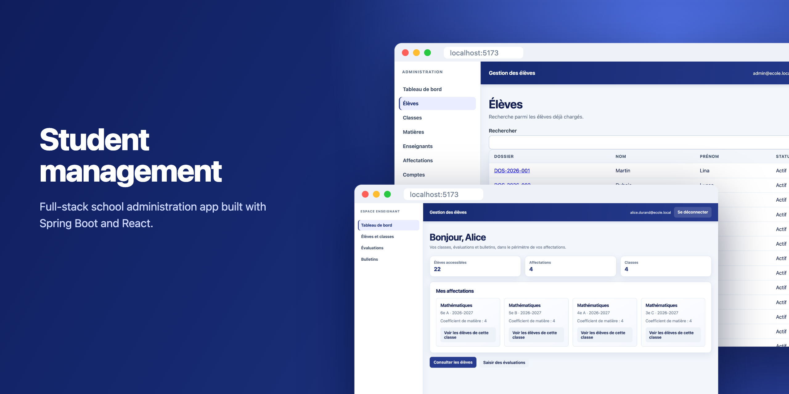

A school administration app with a Spring Boot API and a React frontend. Admins manage students,
classes, teachers and subjects. Teachers record grades for the classes they are assigned to. The
system computes weighted averages and produces term report cards as PDFs.

I built it during the CDA (Concepteur Développeur d'Applications) training at AFPA in 2026. The
interface is in French because it targets French schools; the code, schema and API use French
domain terms (`eleve`, `classe`, `bulletin`).


## Screenshots

These were taken from the Docker Compose setup with a seeded demo dataset: 4 classes, 22 students,
8 teachers and first-term grades.

| | |
|---|---|
| 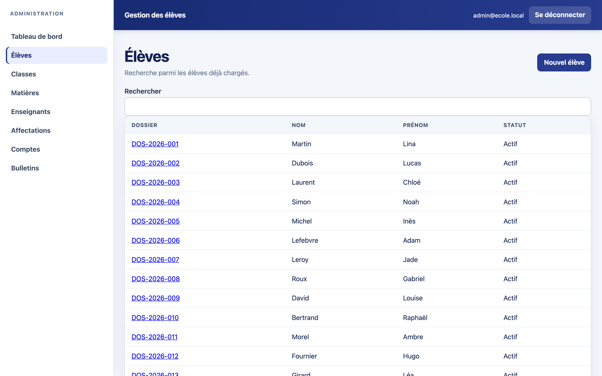 | 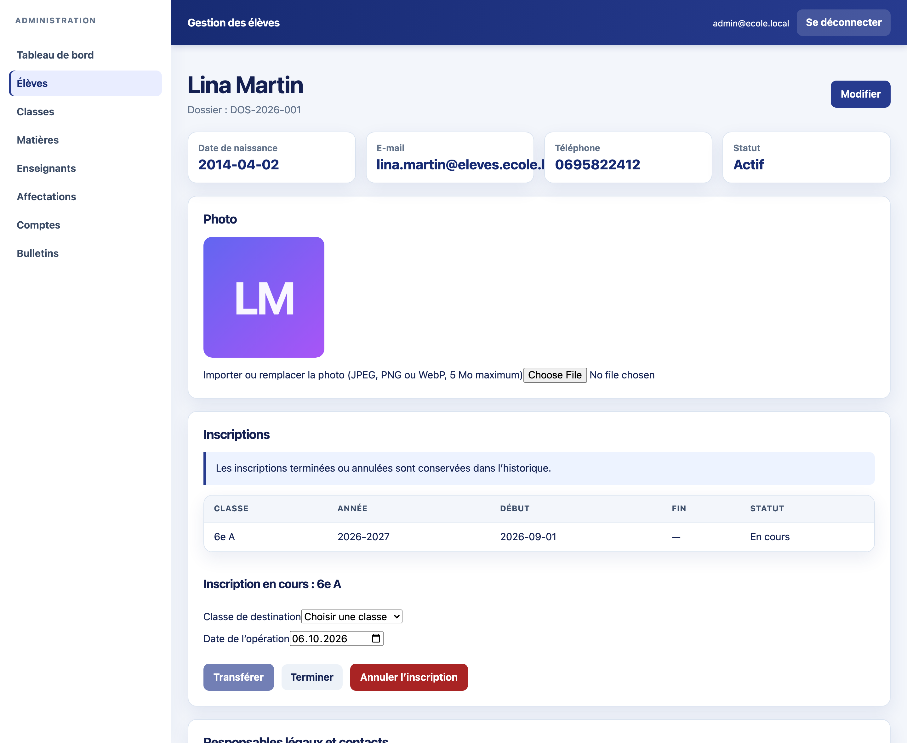 |
| Student list with search | Student record: photo, enrolments, legal guardians |
| 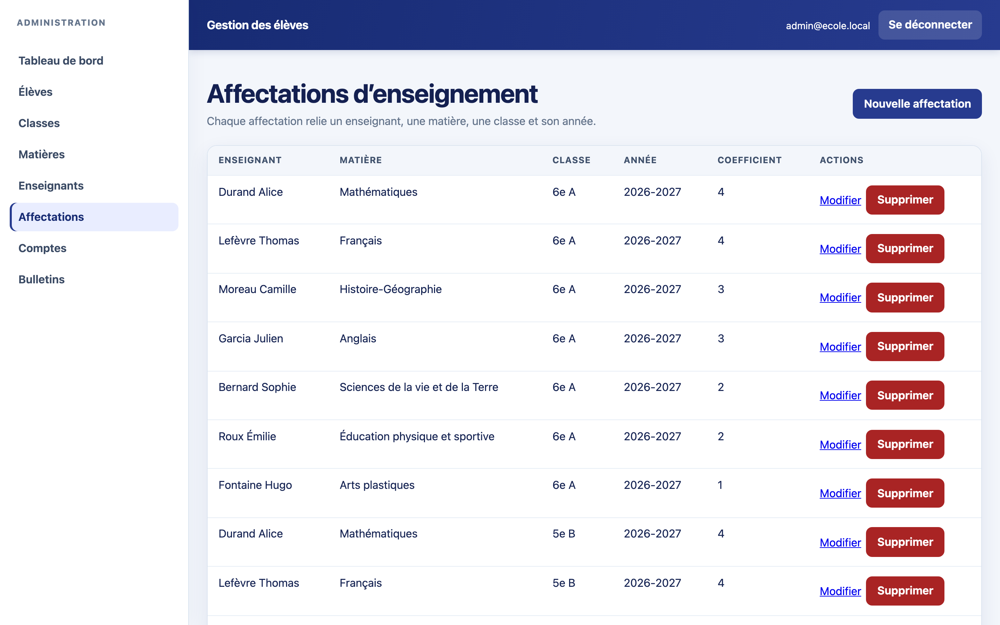 | 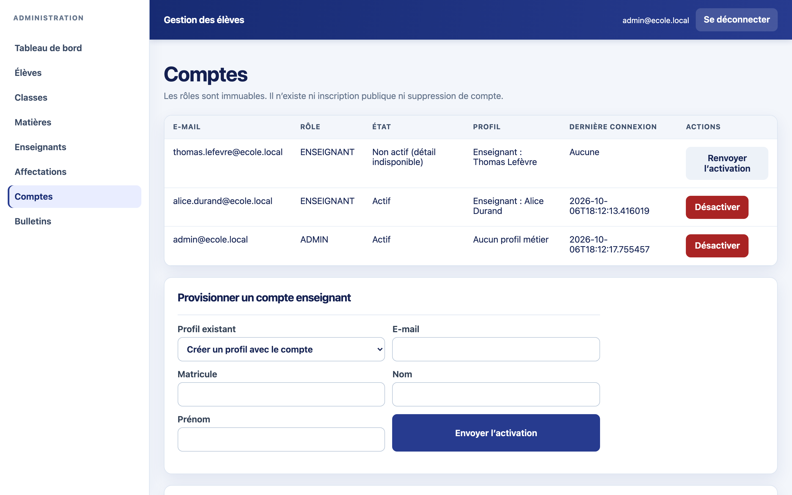 |
| Teaching assignments (teacher, subject, class, coefficient) | User accounts and invitations |
| 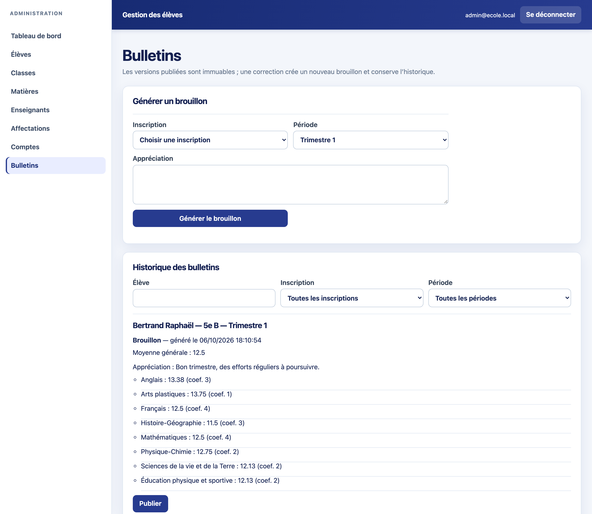 | 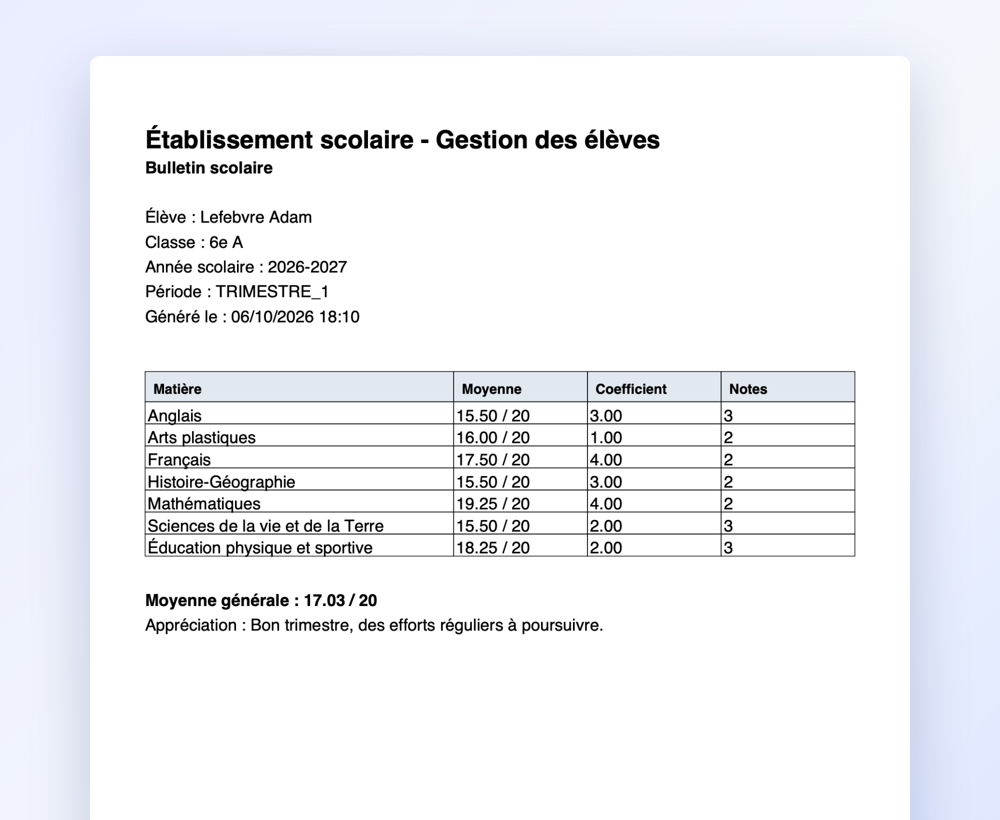 |
| Report card drafts, publishing and version history | Generated PDF report card |
| 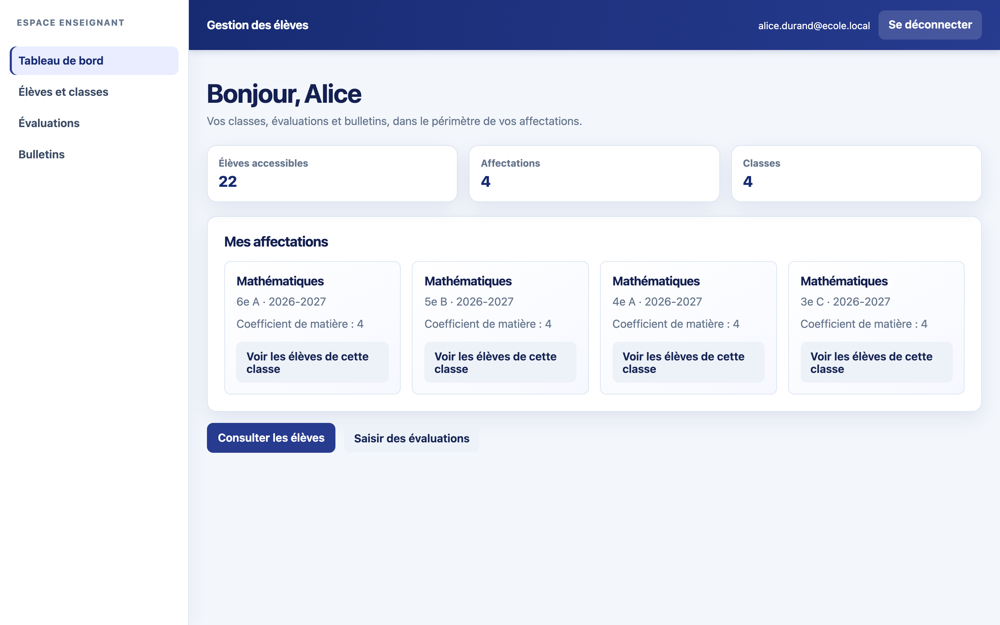 | 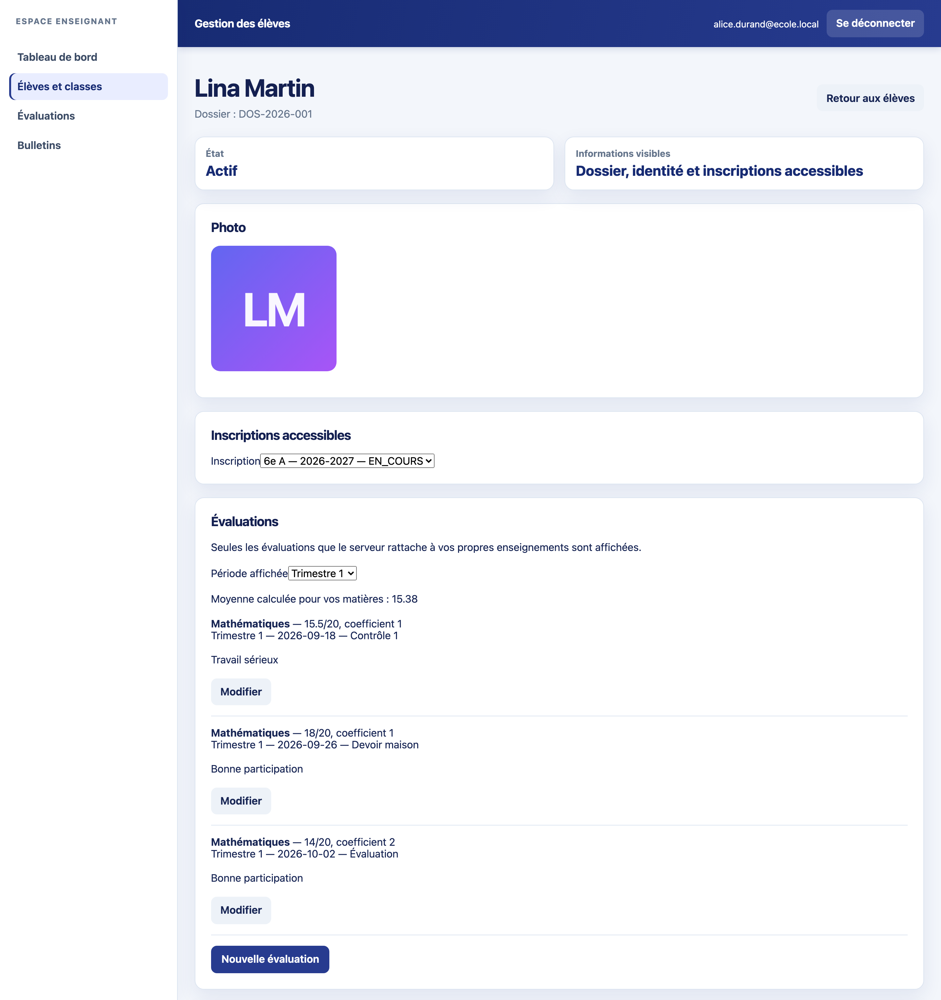 |
| Teacher dashboard, limited to the teacher's own assignments | Grade entry for one student |
| 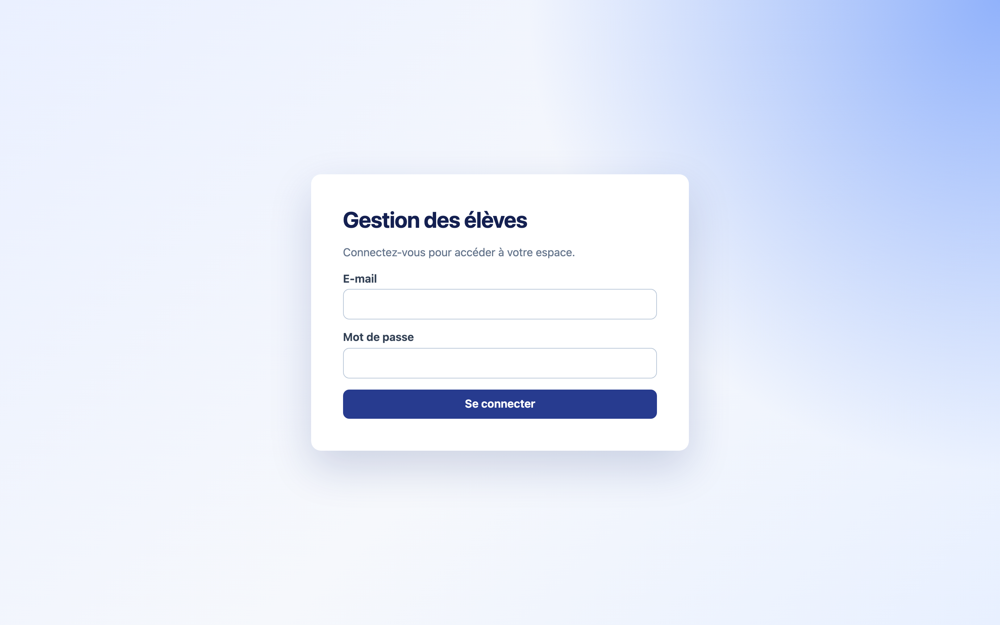 | 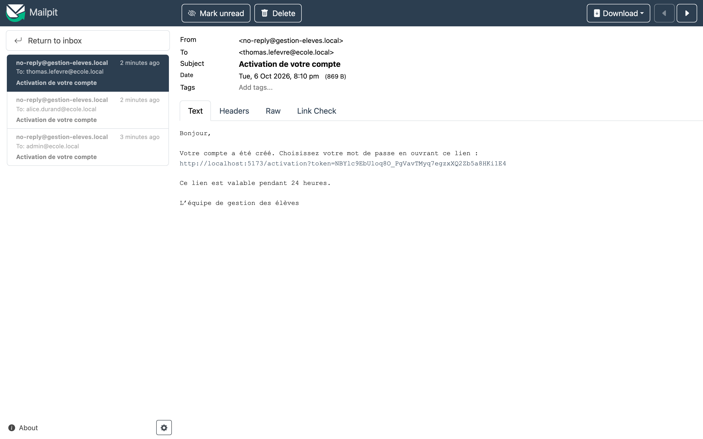 |
| Login | Account activation email, caught by Mailpit in development |

## Features

### Admin portal

- Manage students, classes, subjects and teachers.
- Upload a student photo (JPEG, PNG or WebP, up to 5 MB).
- Enrol a student in a class, transfer them to another class, end or cancel the enrolment. Past
  enrolments stay in the history.
- Link legal guardians to a student, with relationship, primary contact, parental authority and
  emergency contact flags.
- Assign a teacher to a subject in a class for a school year, with a subject coefficient.
- Invite teacher and guardian accounts by email, resend invitations, deactivate accounts.
- Generate a report card draft, publish it, and issue a corrected version later.

### Teacher portal

- See only the classes, students and subjects the teacher is assigned to.
- Add and edit grades (out of 20, with coefficient, date, label and comment).
- Read published report cards and download them as PDF.

### Business rules

- A student has at most one active enrolment per school year.
- A grade must belong to a teaching assignment in the same class and year as the enrolment.
- Subject averages are weighted by grade coefficient. The overall average is weighted by subject
  coefficient. Results are rounded half-up to two decimals.
- A report card stores a snapshot of the averages. Changing a grade afterwards does not change a
  published card; an admin issues a correction, which becomes a new version.
- Grades and report cards use optimistic locking, so two concurrent edits cannot silently overwrite
  each other.

The API already supports the guardian (`RESPONSABLE`) role, including access restricted to the
guardian's own children. The guardian screens in the frontend are not built yet.

## Tech stack

| Area | Tools |
|---|---|
| Backend | Java 21, Spring Boot 3.5, Spring Web, Spring Data JPA, Bean Validation |
| Security | Spring Security, OAuth2 Resource Server (HS256 JWT), BCrypt |
| Database | PostgreSQL 15, Flyway (6 migrations, Hibernate in `validate` mode) |
| PDF and email | OpenPDF, Spring Mail, Mailpit for local SMTP |
| Frontend | React 19, TypeScript, Vite, React Router, Axios |
| Tests | JUnit 5, Mockito, AssertJ, MockMvc, Testcontainers, Vitest, Testing Library |
| Infrastructure | Multi-stage Dockerfiles, Docker Compose, Nginx |
| Design docs | Merise (MCD, MLD, MPD), UML in PlantUML |

## Architecture

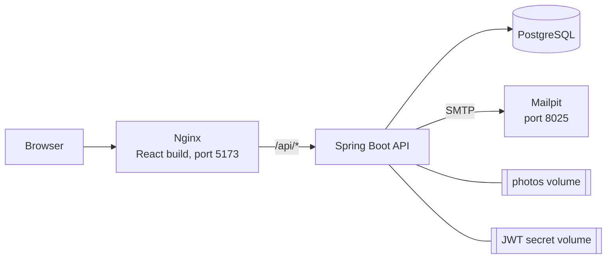

Only Nginx and Mailpit publish ports. The API and the database are reachable only on the internal
Docker network.

The backend is layered: REST controllers take and return DTOs (Java records), transactional
services hold the business rules, and Spring Data repositories talk to PostgreSQL. JPA entities are
never serialized directly. A single exception handler returns errors as `ProblemDetail`. Access
checks live in one place, `AccessPolicyService`, which every controller calls. Flyway owns the
schema; Hibernate only validates it at startup.

## Security

- Access tokens are 15-minute JWTs kept in memory on the client, never in `localStorage`.
- Refresh tokens live in an `HttpOnly`, `Secure`, `SameSite=Strict` cookie scoped to `/api/auth`
  and last 7 days. Every refresh rotates the token. If an old token is presented again, the whole
  session family is revoked.
- The cookie-based auth endpoints are protected against CSRF with a double-submit token.
- There is no public sign-up. An admin creates the account, the user gets a single-use activation
  link by email and picks their own password (12 to 64 characters, hashed with BCrypt, cost 12).
- Activation and reset tokens are 256-bit random values. Only their SHA-256 hash is stored.
- Each request is checked against the user's role and ownership of the resource. A teacher asking
  for a student outside their classes gets `404`, so the API does not reveal that the record exists.
- Security events (invitations, activations, password resets, token reuse, deactivations) are
  written to an audit table.
- Uploaded photos are checked by file signature, not just by MIME type, and stored under a
  generated UUID name.
- In Docker, the JWT signing key is generated into a volume on first start. It is not in the
  repository or in any image.

## Running locally

You need Docker with Compose, and ports 5173 and 8025 free.

```bash
git clone https://github.com/x451F/gestion-eleves-spring-react.git
cd gestion-eleves-spring-react
docker compose up --build -d
```

The app is at http://localhost:5173 and Mailpit at http://localhost:8025.

The database starts empty. Create the first admin with the one-off bootstrap service. It creates
the account in a pending state and sends an activation email; it never sets a password.

```bash
BOOTSTRAP_ADMIN_EMAIL=admin@ecole.local \
docker compose --profile bootstrap up bootstrap-admin
```

Open the email in Mailpit, follow the link, choose a password and log in. Teacher accounts are
invited the same way from the Comptes page.

`docker compose down` stops everything and keeps the data. Add `-v` to delete the volumes too.

<details>
<summary>Running without Docker</summary>

Start PostgreSQL first, then:

```bash
export APP_SECURITY_JWT_SECRET_BASE64=$(openssl rand -base64 32)
cd backend && ./mvnw spring-boot:run
```

```bash
cd frontend && npm install && npm run dev   # Vite proxies /api to 127.0.0.1:8080
```

</details>

<details>
<summary>Configuration</summary>

See [`.env.example`](.env.example). Never commit a real `.env`.

| Variable | Local default | Purpose |
|---|---|---|
| `POSTGRES_DB`, `POSTGRES_USER`, `POSTGRES_PASSWORD` | `gestion_eleves`, `gestion_eleves`, `gestion_eleves_dev` | Database created by Docker |
| `DB_URL` | `jdbc:postgresql://localhost:5432/gestion_eleves` | JDBC URL |
| `DB_USERNAME`, `DB_PASSWORD` | `gestion_eleves`, `gestion_eleves_dev` | JDBC credentials |
| `APP_SECURITY_JWT_SECRET_BASE64` | generated in Docker | JWT signing key |
| `UPLOAD_DIR` | `uploads/eleves` | Photo storage directory |
| `FRONTEND_ORIGIN` | `http://localhost:5173` | Allowed CORS origin |
| `MAX_PHOTO_SIZE`, `MAX_PHOTO_SIZE_BYTES` | `5MB`, `5242880` | Photo size limit |
| `MAIL_HOST`, `MAIL_PORT` | `localhost`, `1025` | SMTP server |
| `SERVER_PORT` | `8080` | API port |
| `SQL_LOG_LEVEL`, `SQL_BIND_LOG_LEVEL` | `WARN` | Hibernate SQL logging. Off by default so personal data does not end up in logs. |

</details>

## Tests

```bash
cd backend && ./mvnw test    # needs Docker for Testcontainers
cd frontend && npm test
```

The backend has 91 tests. Unit tests cover the services (enrolments, grades, averages, report
cards, guardians), PDF generation, photo storage and the refresh cookie. Integration tests run the
whole API through MockMvc against a throwaway PostgreSQL container: login, token refresh and reuse
detection, `401`/`403` cases, the enrolment lifecycle, report card versions, optimistic locking and
the Flyway migrations.

The frontend has 45 Vitest tests covering the auth context, the HTTP interceptors and the admin and
teacher pages.

## Project structure

```text
backend/
  src/main/java/fr/afpa/gestioneleves/
    controller/         REST endpoints
    service/            business rules, access policy, account workflows
    security/           JWT, refresh tokens, CSRF, password policy
    entity/, repository/
    dto/, mapper/
    pdf/, storage/
    exception/
  src/main/resources/db/migration/   Flyway V1 to V6
frontend/src/
  auth/                 auth context, HTTP client with automatic refresh
  admin/                admin portal
  teacher/              teacher portal
docs/
  api/                  REST contract, Postman collection
  merise/               MCD, MLD, MPD
  uml/                  use case, class and sequence diagrams
  screenshots/
docker-compose.yml
```

## Design documents

- REST contract: [`docs/api/endpoints.md`](docs/api/endpoints.md)
- Conceptual data model (MCD): [`docs/merise/mcd.svg`](docs/merise/mcd.svg)
- Logical data model (MLD): [`docs/merise/mld.md`](docs/merise/mld.md)
- Physical data model (MPD): [`docs/merise/mpd.sql`](docs/merise/mpd.sql)
- Use case diagram: [`docs/uml/use-case.svg`](docs/uml/use-case.svg)
- Class diagram: [`docs/uml/class-diagram.svg`](docs/uml/class-diagram.svg)
- Sequence diagram for adding a grade: [`docs/uml/sequence-add-note.svg`](docs/uml/sequence-add-note.svg)

## Not done yet

- Guardian screens in the frontend
- Server-side pagination and sorting
- Object storage for photos (they are on a local volume for now)
- Statistics on the admin dashboard
- A CI pipeline
